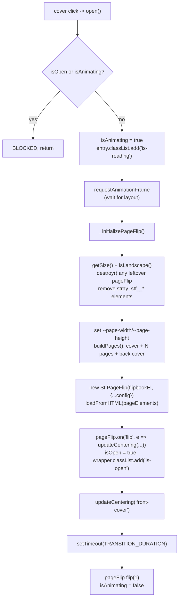
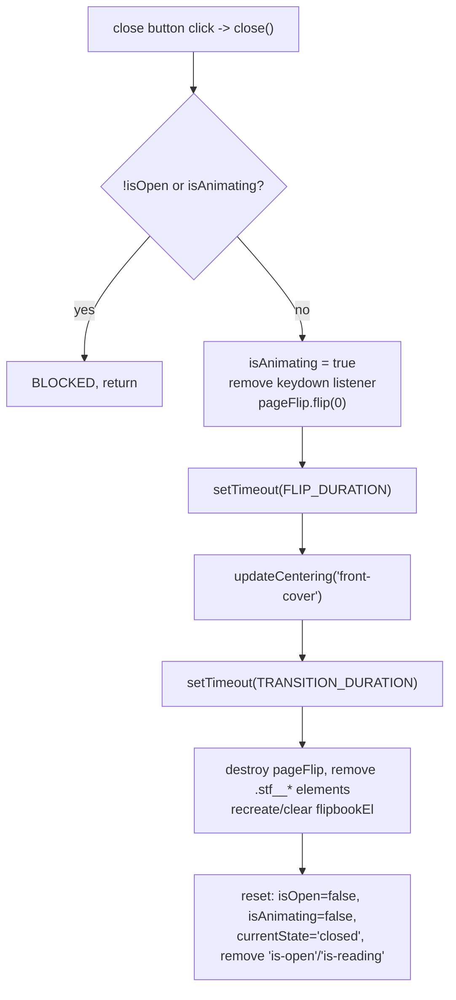

# Book Reader — Flow

**About:** [description](../__about/bookReader.md)

## Algorithm — open()

## Algorithm — close()

Pseudocode (language-neutral):

    ON cover click / open():
        IF isOpen OR isAnimating: RETURN
        isAnimating = true
        mark entry "is-reading" (hides book-info, book+controls fill space)
        WAIT one animation frame (so layout reflects "is-reading")
        getSize() from stage's actual dimensions + configured aspect ratio
        destroy any leftover PageFlip instance, strip stray library DOM
        set CSS vars --page-width/--page-height on wrapper
        buildPages(): flipbookEl = [front cover, ...content pages, back cover]
        construct new St.PageFlip(flipbookEl, config) and loadFromHTML()
        on every 'flip' event: recompute centering state from (page, totalPages)
            page == 0            -> 'front-cover'
            page >= totalPages-1 -> 'back-cover'
            else                 -> 'spread'
        mark isOpen = true, updateCentering('front-cover')
        attach keyboard listener (Escape/ArrowLeft/ArrowRight)
        AFTER TRANSITION_DURATION: pageFlip.flip(1)  # reveal first content page
        isAnimating = false

    ON close button click / close():
        IF !isOpen OR isAnimating: RETURN
        isAnimating = true, remove keyboard listener
        pageFlip.flip(0)                      # flip back to cover
        AFTER FLIP_DURATION:
            updateCentering('front-cover')
            AFTER TRANSITION_DURATION:
                destroy pageFlip, strip .stf__* DOM, reset flipbookEl
                reset all state flags, remove 'is-open'/'is-reading' classes

## updateCentering(state) — the 3-state translateX

    IF NOT landscape (mobile): translateX(0), return   # single page, no centering math needed
    SWITCH state:
        'front-cover' -> translateX(-pageWidth/2)   # shift left so the single right page centers
        'spread'      -> translateX(0)               # centered on the spine
        'back-cover'  -> translateX(+pageWidth/2)   # shift right so the single left page centers

## Notes

- **Two nested `setTimeout`s in `close()` (FLIP_DURATION, then
  TRANSITION_DURATION) hard-code the same durations `_initializePageFlip()`
  passes to St.PageFlip and to `updateCentering`'s CSS transition** — there
  is no `Promise`/event-based handshake with either the library's flip
  animation or the CSS transition actually finishing; if either duration is
  changed only in one place (config `flippingTime` vs. the CSS
  `--book-transition-duration`), the two clocks can drift out of sync. Not
  observed failing in this session, but a coupling worth knowing about —
  see [Book Reader CSS](../../css/__about/book-reader.md).
- **`open()`/`close()`/`_initializePageFlip()` log unconditionally** — see
  [JS (folder)](../___js.md)'s Design Decisions and
  [Open Questions](../../../OPEN-QUESTIONS.md).
