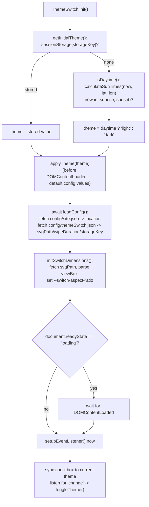
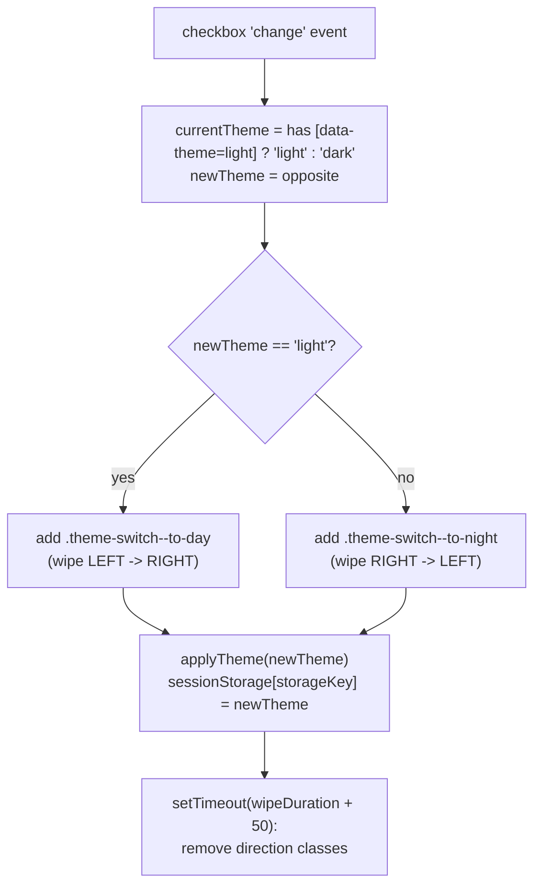

# Theme Switch — Flow

**About:** [description](../__about/themeSwitch.md)

## Algorithm — init()

## Algorithm — toggleTheme()

Pseudocode — sunrise/sunset (NOAA Solar Calculator, `calculateSunTimes`):

    dayOfYear = day-of-year(date)
    gamma = (2*PI/365) * (dayOfYear - 1)                     # fractional year, radians
    eqTime = equation-of-time(gamma)                          # minutes, Fourier series
    decl   = solar-declination(gamma)                         # radians, Fourier series
    hourAngle = acos( cos(zenith=90.833°)/(cos(lat)*cos(decl)) - tan(lat)*tan(decl) )
                clamped to [-1, 1] before acos (handles polar day/night)
    solarNoonUTC = 720 - eqTime - 4*longitude                 # minutes from UTC midnight
    sunriseUTC = solarNoonUTC - hourAngle*4
    sunsetUTC  = solarNoonUTC + hourAngle*4
    RETURN { sunrise: Date(sunriseUTC), sunset: Date(sunsetUTC) }   # built via Date.UTC, displays local

## Notes

- **Theme is applied TWICE, deliberately** — once immediately with hardcoded
  default config (Belgrade coordinates, before any network round-trip, to
  avoid a flash of the wrong theme), then `loadConfig()` fetches the real
  `location`/`svgPath`/etc. and `initSwitchDimensions()` re-reads the SVG —
  but the theme itself is NOT recomputed after config loads unless the user
  has no stored preference on the NEXT toggle. This is a deliberate flash
  vs. accuracy trade-off, not an oversight.
- **`sessionStorage`, not `localStorage`** — the user's manual toggle choice
  does not persist across browser sessions/tabs; a fresh session always
  recomputes from sunrise/sunset.
- All debug output (`console.group`/`console.log`/`console.warn`) is gated
  behind `window.MV_IS_ADMIN` throughout this file — the one module in
  [JS (folder)](../___js.md) that consistently follows that convention.
