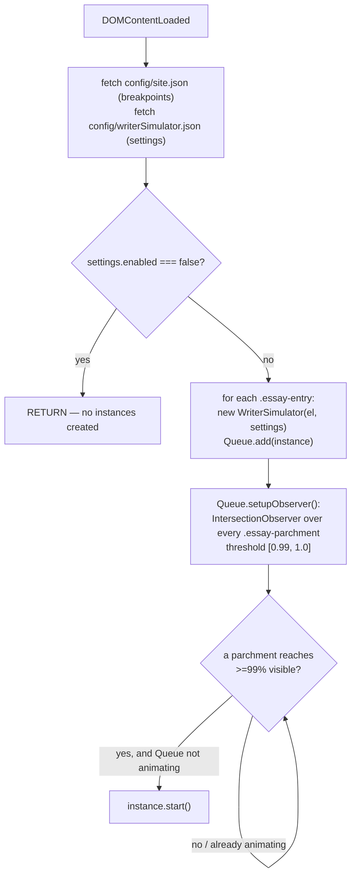
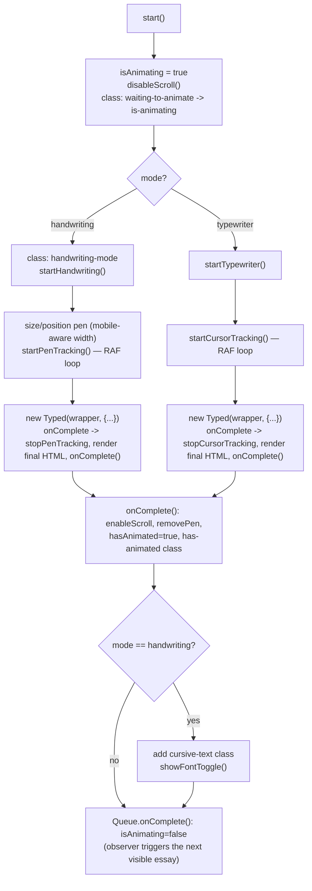

# Writer Simulator — Flow

**About:** [description](../__about/writerSimulator.md)

## Algorithm — page load to first animation

## Algorithm — instance.start() (mode branch)

## Pen tracking (handwriting mode only)

    EVERY animation frame WHILE isAnimating:
        find LAST TEXT NODE inside the Typed.js wrapper
        range = Range at that node's end
        rects = range.getClientRects()
        IF rects exist:
            penX = rects.last.right - paperLeft + offsetX, clamped to [0, paperWidth - penWidth - 10]
            penY = rects.last.top - paperTop - penHeight + offsetY
            position pen at (penX, penY); reveal pen on first successful position
            scrollPenIntoView(): if pen bottom is within 80px of viewport bottom,
                                  smooth-scroll just enough to clear it

## Notes — drift caught against the legacy planning docs

- **The legacy brainstorming/plan docs (`docs/brainstorming/writer-simulator/003-*.md`,
  `docs/plans/writer-simulator/003-*.md`) describe handwriting mode built on
  Vara.js** (SVG stroke-by-stroke drawing, `getPointAtLength()` path
  tracking, a `assets/fonts/vara/*.json` font file, CDN-loaded). **None of
  that shipped.** The actual code uses Typed.js for BOTH modes and tracks
  the pen via the DOM `Range` API against Typed.js's own revealed text —
  simpler, and consistent with the project's later "no external CDN,
  download everything locally" rule (both libraries are vendored under
  `assets/libraries/`, not CDN-loaded). No `assets/fonts/vara/` directory
  exists on disk. This migration folded only the parts of those docs that
  still match reality (the two-mode concept, the config shape) and dropped
  the Vara.js-specific architecture.
- **`docs/reports/writer-simulator/004-writer-simulator-fixes.md` claims a
  `--cursive-line-height` CSS variable was added for font-size/line-height
  unification** — it was not; see
  [Writer Simulator CSS](../../css/__about/writer-simulator.md)'s Design
  Decisions. Flagged in [Open Questions](../../../OPEN-QUESTIONS.md).
- **`disableScroll()`/`enableScroll()` and the 100%-visibility
  `IntersectionObserver` threshold both match the legacy fix docs'
  proposals exactly** — that part of the drift-check confirmed rather than
  contradicted the historical record.
